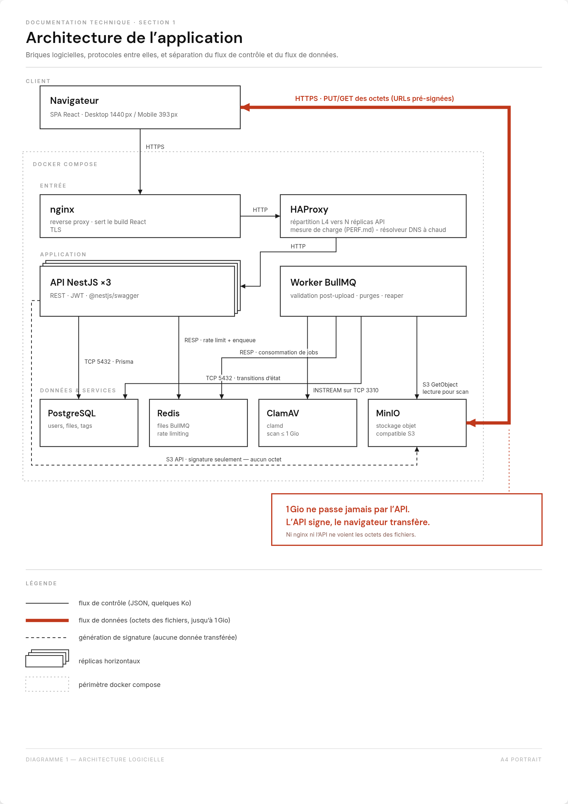
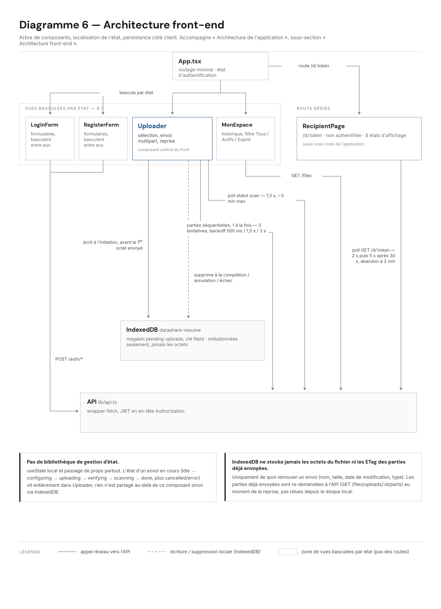
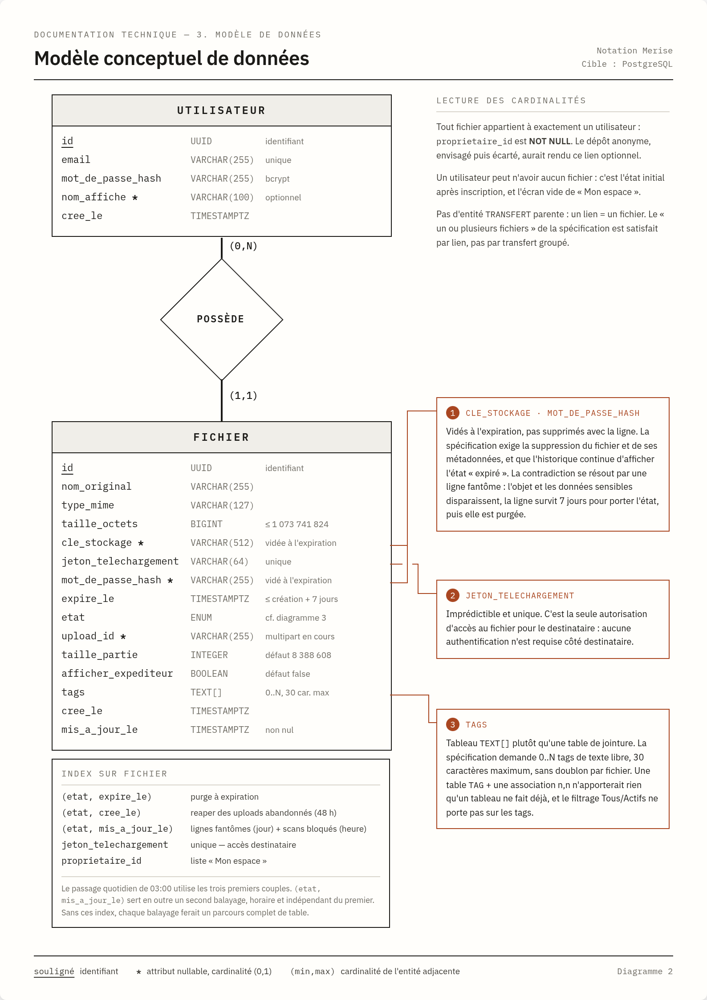
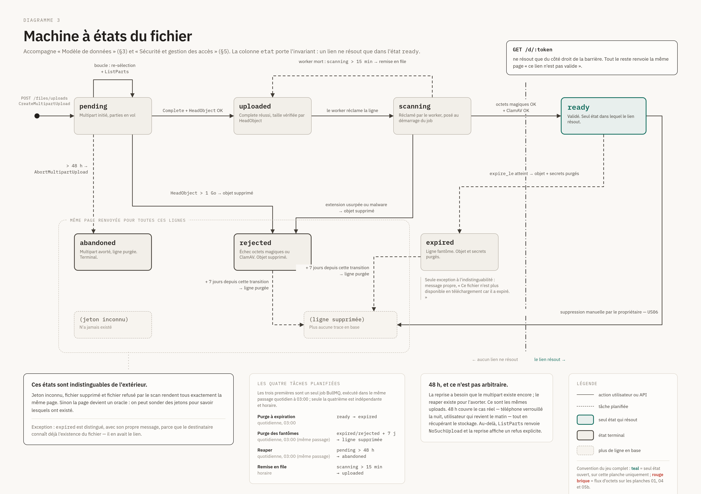
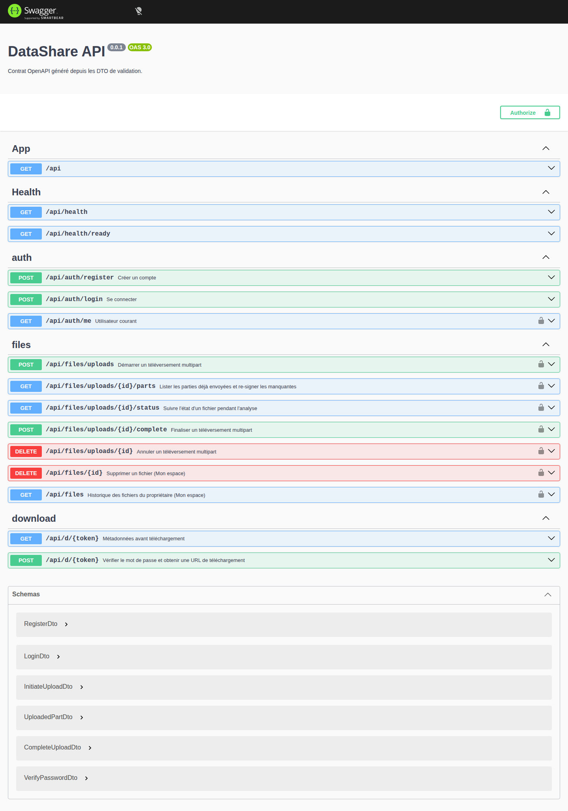
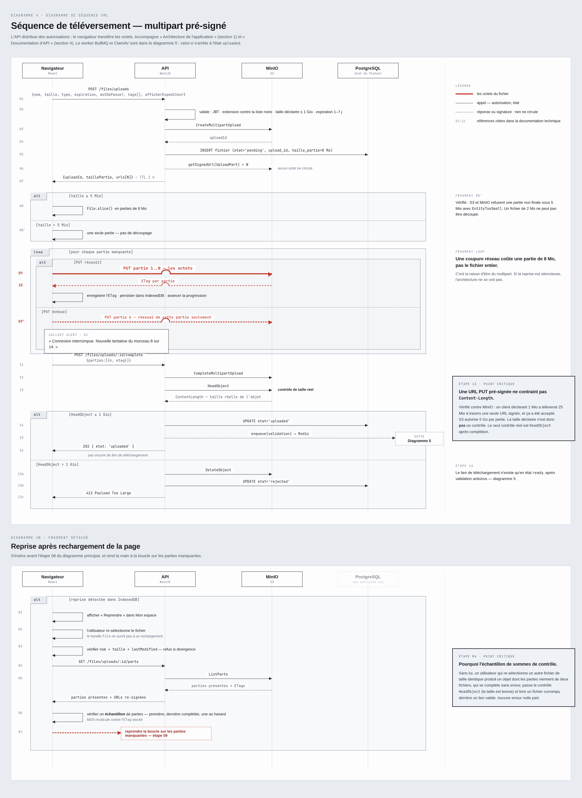
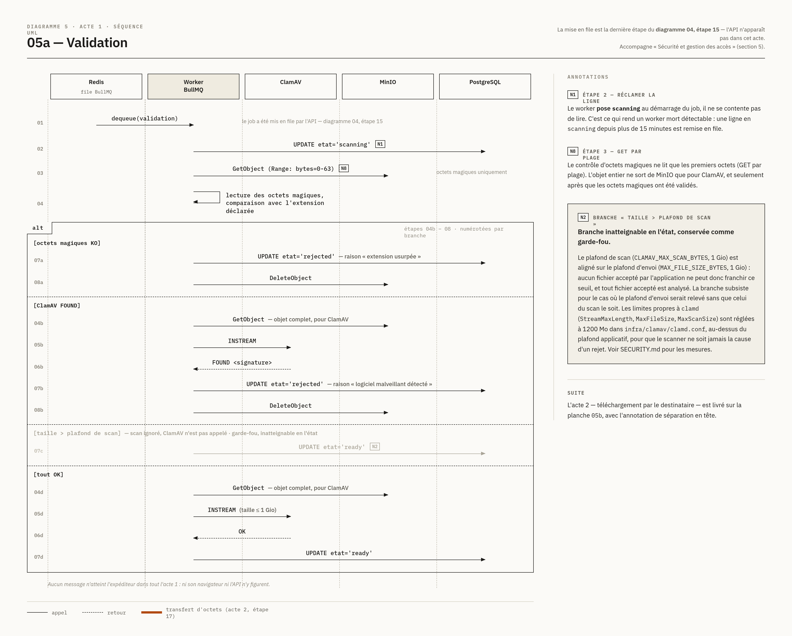
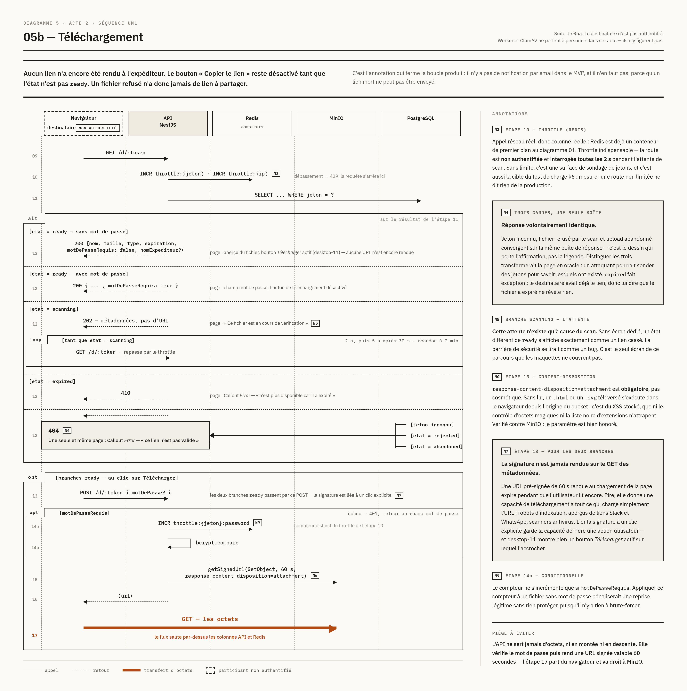

# DataShare : Documentation technique

**Projet** : plateforme de transfert sécurisé de fichiers (MVP)
**Auteur** : Nathan Boukobza
**Date** : août-septembre 2026 (dernière relecture le 2026-09-06)
**Dépôt** : https://github.com/M0l42/OC-P4-Datashare

> **Convention de lecture** : tous les chiffres cités (couverture de tests, mesures de charge, temps d'analyse antivirale) proviennent d'exécutions réelles contre la pile locale, pas d'estimations. Chaque section indique le fichier de suivi où la mesure est détaillée. Les références `QA-xx` et `SOC-xx` citées dans le texte renvoient au board de suivi (Notion), externe au dépôt.

---

## Sommaire

- [Compétences visées](#compétences-visées) (les sept compétences du référentiel → où elles sont traitées)
- [Matrice de traçabilité](#matrice-de-traçabilité) (US → endpoint → écran → tests)

1. [Architecture de l'application](#1-architecture-de-lapplication)
2. [Choix technologiques justifiés](#2-choix-technologiques-justifiés)
3. [Modèle de données](#3-modèle-de-données)
4. [Documentation d'API](#4-documentation-dapi)
5. [Sécurité et gestion des accès](#5-sécurité-et-gestion-des-accès)
6. [Qualité, tests et maintenance](#6-qualité-tests-et-maintenance)
7. [Processus d'installation et d'exécution](#7-processus-dinstallation-et-dexécution)
8. [Utilisation de l'IA dans le développement](#8-utilisation-de-lia-dans-le-développement)
- [Annexe : références QA-xx et SOC-xx](#annexe--références-qa-xx-et-soc-xx)

---

## Compétences visées

La mission est conduite en six étapes (conception, initialisation, US03/US04, fonctionnalités, tests, documentation), mais c'est sur sept compétences du référentiel que porte l'évaluation. Deux sur sept sont front, ce qui a guidé l'arbitrage sur la place de l'architecture front-end dans ce document (voir section 1) : une demi-page en tête plutôt qu'une section numérotée séparée, puisque le jury la retrouve ici sans avoir à la chercher.

| Compétence | Où c'est traité |
|---|---|
| Développer les composants et interfaces d'une application | Section 1, « Architecture front-end » (arbre de composants, `components/ds/`, huit états `RecipientPage`), diagramme 6 |
| Analyser et concevoir une API pour intégrer le front-end et le back-end d'une application | Section 4 entière, diagrammes 4 et 4b, matrice de traçabilité ci-dessous |
| Assurer la performance, la conformité et la maintenance du code | Section 6 (`TESTING.md`, `SECURITY.md`, `PERF.md`, `MAINTENANCE.md`), tableau k6, `npm audit`, les quatre tâches planifiées |
| Définir l'architecture front-end d'une application | Section 1, « Architecture front-end » (routage, gestion d'état, IndexedDB, bundle), lignes front du tableau des choix en section 2 |
| Mettre en œuvre les tests pour améliorer une solution | Section 6 (`TESTING.md`), colonne Tests de la matrice de traçabilité, `docs/test-plan.md` |
| Rédiger la documentation technique | Ce document, section 7, `docs/api/openapi.json` |
| Prendre en charge l'implémentation de l'architecture back-end | Section 1 (modules NestJS, inversion de responsabilité, scénarios de panne), section 3, section 5 |

---

## Matrice de traçabilité

Neuf user stories en périmètre (US01 à US06, US08 à US10 ; US07 écartée, voir section 2). Pour chacune : la route qui la sert, l'écran qui la porte, et les tests qui la couvrent.

| US | Endpoint(s) | Écran | Tests |
|---|---|---|---|
| US01 : envoi (≤ 1 Gio, expiration 1-7 j) | `POST /files/uploads`, `GET .../parts`, `GET .../status`, `POST .../complete` | `Uploader` | `files.controller.spec.ts`, `files.service.spec.ts`, `files.e2e-spec.ts`, `resume-upload.cy.js` |
| US02 : téléchargement par lien | `GET /d/:token`, `POST /d/:token` | `RecipientPage` | `download.controller.spec.ts`, `download.service.spec.ts`, `download.e2e-spec.ts`, `register-upload-download.cy.js` |
| US03 : inscription | `POST /auth/register` | `RegisterForm` | `auth.controller.spec.ts`, `auth.service.spec.ts`, `register-upload-download.cy.js` |
| US04 : connexion | `POST /auth/login` | `LoginForm` | `auth.controller.spec.ts`, `auth.service.spec.ts`, `jwt.strategy.spec.ts`, `register-upload-download.cy.js` |
| US05 : historique (Mon espace) | `GET /files` | `MonEspace` | `file-history.controller.spec.ts`, `file-history.e2e-spec.ts` |
| US06 : suppression (IA) | `DELETE /files/:id` | `ConfirmDeleteDialog` (dans `MonEspace`) | `file-deletion.controller.spec.ts`, `file-deletion.service.spec.ts`, `file-deletion.e2e-spec.ts` |
| US08 : tags | `POST /files/uploads` (champ `tags`), `GET /files` | `Uploader`, `MonEspace` | `files.service.spec.ts`, `file-history.e2e-spec.ts` |
| US09 : mot de passe de fichier | `POST /files/uploads` (champ `motDePasse`), `POST /d/:token` | `Uploader`, `RecipientPage` | `download.service.spec.ts`, `download.e2e-spec.ts` (mauvais mot de passe → 401, bon mot de passe → URL signée, aucune URL sur `GET` tant qu'il n'est pas fourni) |
| US10 : expiration et purge | aucun (job planifié) ; effet visible via `GET /files` et `GET /d/:token` | `MonEspace` (ligne « Expiré »), `RecipientPage` (état expiré) | `purge.service.spec.ts`, `purge-queue.service.spec.ts`, `purge.worker.spec.ts`, `purge.e2e-spec.ts` |

Le chemin de validation post-upload (octets magiques, ClamAV) n'est pas une user story à lui seul mais conditionne US01 et US02 : `scan.worker.spec.ts`, `validation.service.spec.ts`, `clamav.client.spec.ts`, `scan.e2e-spec.ts`, `scan-rejection.cy.js`.

---

## 1. Architecture de l'application



*Diagramme 1 : architecture logicielle.*

### Vision globale

DataShare est une application web à séparation front/back stricte, déployée comme un ensemble de conteneurs orchestrés par `docker compose`. Le front est une SPA React servie en statique ; le back est une API REST NestJS ; le stockage des fichiers est délégué à un service objet compatible S3.

| Brique | Rôle |
|---|---|
| nginx | Sert le build React, proxifie `/api` vers HAProxy, point de terminaison TLS |
| API NestJS (×N) | Endpoints REST, authentification JWT, signature des URLs de stockage, génération de la spécification OpenAPI |
| PostgreSQL | Utilisateurs, fichiers, tags |
| Redis | Support de files BullMQ et limitation de débit |
| MinIO | Stockage objet compatible S3 |
| Worker BullMQ | Validation post-upload, purges planifiées, reaper des uploads abandonnés |
| ClamAV | Analyse antivirale de tous les fichiers acceptés (plafond de scan aligné sur le plafond d'envoi, 1 Gio) |
| HAProxy | Répartition de charge sur les réplicas de l'API, découverte par DNS (suit `make scale`) |

Chaque conteneur répond à la question « pourquoi existe-t-il » en une phrase. Aucun n'est présent par principe.

### La propriété centrale : l'API ne transporte jamais les octets

US01 autorise des fichiers jusqu'à 1 Gio. L'implémentation naïve fait transiter ce gigaoctet par l'API, ce qui occupe un worker applicatif et un tampon nginx pendant toute la durée du transfert, et fait perdre l'intégralité de l'envoi à la moindre coupure réseau.

L'architecture retenue inverse la responsabilité : **l'API distribue des autorisations, le navigateur transporte les données.**

- Au téléversement, l'API initie un *multipart upload* S3 et renvoie des URLs pré-signées, une par partie de 8 Mio (`taille_partie` = 8 388 608 octets). Le navigateur découpe le fichier avec `File.slice()` et envoie chaque partie **directement à MinIO**. Une coupure réseau coûte une partie de 8 Mio, pas le fichier.
- Au téléchargement, l'API vérifie le jeton, l'état et le mot de passe, puis renvoie une URL pré-signée valable 60 secondes. Le navigateur récupère les octets **directement depuis MinIO**.

Conséquence mesurable : l'API reste disponible quel que soit le volume transféré, et les identifiants de stockage ne quittent jamais le serveur.

### Sécurisation des échanges

- Navigateur ↔ nginx : HTTPS visé en production. **En développement local, la pile sert tout en HTTP** (`docker-compose.yml` ne monte aucun certificat, nginx n'écoute que le port 80). La terminaison TLS reste un chantier de déploiement : voir `SECURITY.md`.
- Navigateur ↔ MinIO : même posture que ci-dessus pour le chiffrement du transport. Indépendamment de ça, l'autorisation est portée par une signature AWS SigV4 à durée de vie limitée (1 h pour les parties en écriture, 60 s en lecture) : la signature protège contre le détournement de l'URL, pas contre l'écoute du réseau.
- API ↔ MinIO : appels S3 authentifiés par les identifiants du serveur, qui ne sont jamais exposés au client.
- Communications inter-conteneurs : réseau Docker interne, aucun port de base de données ou de Redis publié vers l'hôte.

### Un scénario de panne par point d'intégration

| Point d'intégration | Panne réaliste | Le système répond |
|---|---|---|
| Navigateur → MinIO | Coupure réseau en cours de transfert | Nouvelle tentative de la partie concernée ; reprise possible 48 h |
| API → MinIO | Signature expirée pendant un envoi lent | Endpoint de re-signature via `ListParts` |
| Worker → ClamAV | `clamd` indisponible | Job remis en file ; ligne bloquée en `scanning` détectée entre 15 et 75 min après la mort du worker (seuil de 15 min, balayage horaire) |
| Worker mort en cours de scan | Processus tué | Ligne en `scanning` détectée entre 15 et 75 min après la mort du worker (seuil de 15 min, balayage horaire), puis remise en file |
| Reaper vs reprise | Le reaper avorte un upload qu'on voulait reprendre | Fenêtre de 48 h ; `NoSuchUpload` produit un refus explicite |
| API → PostgreSQL | Perte de connexion pendant `complete` | Objet assemblé côté S3 mais ligne restée `pending` : le reaper reçoit `NoSuchUpload` sur `AbortMultipartUpload` (le multipart n'existe plus), puis vérifie l'objet par `HeadObject` et le supprime avant de purger la ligne (`file-deletion.service.ts`) |

### Architecture des modules NestJS

Deux racines de composition dans le même code source, pas deux applications : `AppModule` (API, `main.ts`) et `WorkerModule` (`worker.main.ts`). La séparation existe pour qu'un worker qui meurt en plein scan n'affecte jamais la disponibilité de l'API, et pour que le traitement des scans et des purges ne dispute jamais la boucle d'événements aux requêtes HTTP.

**`AppModule`** (API) :

| Module | Importe | Fournit |
|---|---|---|
| `AuthModule` | `PassportModule`, `JwtModule` (24 h) | `AuthController` (`/auth/*`), `AuthService`, `JwtStrategy` |
| `FilesModule` | `StorageModule`, `ScanModule` | `FilesController` (cycle de vie de l'upload), `FileDeletionController` (US06), `FileHistoryController` (US05), `FilesService`, `FileDeletionService` |
| `DownloadModule` | `StorageModule` | `DownloadController`, `DownloadService` |
| `RedisThrottlerModule` | *(aucun)* | Limitation de débit (section 5) |
| `PrismaModule` | *(aucun)* | `PrismaService`, `@Global()`, un seul client pour tout le processus |
| `ScanModule` (importé par `FilesModule`, pas directement par `AppModule`) | `StorageModule` | `ScanQueueService` (producteur seul : met les jobs en file, ne les consomme jamais côté API) |

Plus `AppController` et `HealthController`, déclarés directement sur `AppModule`.

**`WorkerModule`** (processus séparé, mêmes fichiers, jamais démarré par l'API) :

| Module | Importe | Fournit |
|---|---|---|
| `ScanWorkerModule` | `PrismaModule`, `StorageModule` | `ScanQueueService`, `ClamAvClient`, `ValidationService`, `ScanWorker` (le consommateur BullMQ réel) |
| `PurgeWorkerModule` | `PrismaModule`, `StorageModule` | `FileDeletionService`, `PurgeQueueService`, `PurgeService`, `PurgeWorker` |

`FileDeletionService` apparaît dans les deux tableaux ci-dessus, mais ce n'est pas la même instance : `AppModule` et `WorkerModule` sont deux processus séparés (deux conteneurs), donc chacun instancie sa propre copie de la classe. Ce qui est réellement partagé, c'est le code : un seul fichier, déclaré comme provider dans `FilesModule` (côté API) et directement dans `PurgeWorkerModule` (côté worker, pas d'import croisé entre les deux modules), jamais dupliqué ni réécrit.

`StorageModule` est le seul point de contact avec le SDK S3 : cinq modules l'importent (`FilesModule`, `DownloadModule`, `ScanModule`, `ScanWorkerModule`, `PurgeWorkerModule`), aucun n'appelle `@aws-sdk/client-s3` directement.

**Deux mécanismes de garde dans tout le code, pas plus** : `JwtAuthGuard` (stratégie Passport JWT), posé au niveau contrôleur sur `FilesController`, `FileDeletionController` et `FileHistoryController`, plus au niveau méthode sur `GET /auth/me` (seule route de `AuthController` qui l'exige) ; `ThrottlerGuard`, posé sur `AuthController` (`register`/`login`), et sa spécialisation `DownloadThrottlerGuard` sur `DownloadController` (voir section 5, le compteur par jeton sur `POST` y est conditionnel au mot de passe du fichier). `DownloadController` et les routes `register`/`login` d'`AuthController` n'ont volontairement aucun `JwtAuthGuard` : ce sont, respectivement, la route non authentifiée par conception (section 5) et les deux points d'entrée qui délivrent un JWT : rien à vérifier avant de l'avoir émis. Aucun intercepteur, pipe ou filtre d'exception personnalisé : la validation passe par le `ValidationPipe` global de Nest (`main.ts`), les erreurs par le filtre d'exception par défaut (forme documentée en section 4).

### Architecture front-end



*Diagramme 6 : architecture front-end.*

**Arbre de composants** (`frontend/src/`) :

| Composant | Responsabilité |
|---|---|
| `App.tsx` | Racine : routage minimal (une seule route réelle, le reste bascule par état), état d'authentification |
| `LoginForm.tsx` / `RegisterForm.tsx` | Formulaires de connexion et d'inscription, basculent entre eux |
| `Uploader.tsx` | Sélection du fichier, orchestration du téléversement multipart, polling du statut de scan, reprise |
| `MonEspace.tsx` | Historique des envois (US05), filtre Tous / Actifs / Expiré |
| `RecipientPage.tsx` | Page publique `/d/:token`, huit états d'affichage (chargement, prêt, mot de passe requis, scan en cours, expiré, invalide, délai dépassé, erreur) |
| `ConfirmDeleteDialog.tsx` | Confirmation de suppression (composant livré par l'IA sur US06) |
| `FileActionsSheet.tsx` | Menu d'actions par fichier dans « Mon espace » |
| `components/ds/` | Primitives du design system : `Button`, `Callout`, `FileInfo`, `Header`, `Input`, `PageShell`, `Select`, `Switch` |

**Gestion d'état** : `useState` local et passage de props, sans bibliothèque de gestion d'état globale (aucun `useContext`, `useReducer`, Redux ou équivalent dans le dépôt). L'état d'un téléversement en cours vit entièrement dans `Uploader.tsx` (`idle` → `configuring` → `uploading` → `verifying` → `scanning` → `done`, plus `cancelled`/`error`) ; rien n'est partagé au-delà de ce composant, sinon via IndexedDB.

**Routage** : une seule route réelle, `/d/:token` (page destinataire, non authentifiée). Connexion, inscription, uploader et « Mon espace » sont des vues basculées par état à la racine `/`, pas des URLs distinctes ; aucune bibliothèque de routage n'est installée.

**Persistance IndexedDB, pour la reprise d'upload** : base `datashare-resume`, magasin `pending-uploads`, clé `fileId`. Ne stocke que les métadonnées nécessaires pour retrouver un envoi (nom original, taille, date de modification, type, date de création), jamais les octets du fichier ni les `ETag` des parties déjà envoyées : ceux-ci sont redemandés à l'API (`GET /files/uploads/:id/parts`) au moment de la reprise. Écriture juste après l'initiation, avant le premier octet envoyé (un rechargement une seconde après le début propose déjà « Reprendre ») ; suppression après complétion, annulation explicite, ou échec terminal.

**Concurrence des parties** : envoi **séquentiel**, une partie à la fois, pas de pool parallèle. Trois tentatives par partie avec un backoff de 500 ms, 1,5 s puis 3 s ; l'échec des trois abandonne le téléversement entier.

**Gestion d'erreur côté client** : huit états distincts côté envoi et huit côté réception (voir tableau ci-dessus), dont un état « invalide » côté destinataire volontairement identique pour jeton inconnu, fichier refusé ou envoi abandonné (voir section 5), et un état « délai dépassé » propre à l'abandon du polling après 2 minutes.

**Responsive** : CSS Modules, deux points de rupture réels (`max-width: 900px`, `max-width: 640px`), plus une règle `prefers-reduced-motion` pour l'accessibilité. Les « 1440 px / 393 px » du diagramme 1 sont des viewports de référence pour la maquette, pas des points de rupture CSS : les deux ne coïncident pas.

**Bundle** : un seul chunk JS et un seul chunk CSS, pas de découpage de code, cohérent avec l'absence de routage. **130,8 Ko gzip**, sous le budget fixé de 200 Ko (QA-07). **Accessibilité Lighthouse 100** après le correctif de contraste (QA-09). Méthode de mesure dans `PERF.md` §3.

---

## 2. Choix technologiques justifiés

### Contrainte de départ

La spécification imposait un choix dans une liste fermée : back-end parmi Spring Boot, .NET Core, NestJS et Symfony/Laravel ; front parmi Angular, React et Vue ; base parmi PostgreSQL et MongoDB ; stockage en système de fichiers local ou S3.

Mon langage de maîtrise est Python avec Django, qui ne figure pas dans la liste. Le choix ne pouvait donc pas se faire sur la compétence acquise, et j'ai préféré l'assumer explicitement : les décisions ci-dessous sont motivées par l'adéquation au problème, pas par mon confort.

### Tableau des choix

| Élément | Technologie choisie | Alternatives | Justification |
|---|---|---|---|
| Langage / back-end | **NestJS (TypeScript)** | Spring Boot, .NET Core, Symfony/Laravel | Un seul langage sur toute la pile, donc des types partagés pour le contrat front/back. Spring Boot a été écarté volontairement : un projet précédent l'utilisait déjà, et diversifier a plus de valeur pour un portfolio. Le modèle modules/providers de NestJS transpose directement celui de Spring, ce qui limite le coût d'apprentissage. |
| Front-end | **React** | Angular, Vue | Familiarité partielle existante, et surtout un besoin de contrôle direct sur `File.slice()`, l'enchaînement des requêtes et la persistance IndexedDB. L'uploader découpé est la pièce la plus délicate du front ; un framework moins explicite sur ces points aurait gêné. |
| Base de données | **PostgreSQL** | MongoDB | Le modèle est relationnel (un utilisateur possède N fichiers) et le livrable exigé est un **MCD**, une notation relationnelle. Modéliser en Merise puis implémenter en documentaire aurait été incohérent. |
| ORM | **Prisma** | TypeORM, Drizzle | Des migrations fiables comptent plus que l'élégance des requêtes quand le schéma bouge chaque jour de la première semaine. Les types générés attrapent les erreurs de schéma à la compilation, ce qui compte double dans un framework qu'on découvre. `schema.prisma` est en outre un artefact lisible à mettre en regard du MCD. TypeORM aurait mieux transposé mon expérience de JPA et Doctrine, mais sa génération de migrations est notoirement peu fiable. |
| Stockage | **MinIO en local, API S3 exclusivement** | Système de fichiers local | Un seul chemin de code (`@aws-sdk/client-s3`) sert MinIO en développement et n'importe quel fournisseur compatible en production. Le stockage local aurait interdit les URLs pré-signées, donc l'architecture entière. |
| File de tâches | **BullMQ sur Redis** | node-cron, tâches en base | Nécessaire pour la validation post-upload, les purges quotidiennes et le reaper. Redis sert aussi de support à la limitation de débit, qui doit être partagée puisque l'API tourne en plusieurs réplicas. |
| Authentification | **JWT émis par l'application, bcrypt** | Keycloak, OAuth2 délégué | US03 et US04 exigent le hachage salé du mot de passe dans notre base et l'émission du jeton. Déléguer à Keycloak aurait cédé une compétence évaluée en échange du conteneur le plus lourd de la pile. |
| Documentation d'API | **`@nestjs/swagger`** | Markdown rédigé à la main | La spécification OpenAPI est générée depuis les DTO déjà écrits pour la validation, donc elle ne peut pas se désynchroniser du code. |
| Journalisation | **`nestjs-pino`** | Logger NestJS par défaut | PERF.md exige des logs structurés et des métriques ; du JSON corrélé par identifiant de requête est exploitable, du texte libre ne l'est pas. |
| Antivirus | **ClamAV, plafond de scan à 1 Gio** | Aucun scan, service tiers | Un produit dont la promesse est la sécurité doit pouvoir répondre à « comment empêchez-vous la diffusion de malware ». Le plafond de scan est aligné sur le plafond d'envoi, donc **tout fichier accepté par l'application est analysé**. Le réglage de `clamd` qui rend cela possible est versionné dans `infra/clamav/clamd.conf`. |
| Tests | **Jest, Supertest, Cypress** | Vitest, Playwright | Jest est l'outil par défaut de NestJS. Supertest couvre le niveau intégration exigé par la mission. Cypress est nommé dans la spécification. |
| Charge | **k6** | Artillery, JMeter | Nommé dans la spécification. Binaire Go qui exécute des scripts JavaScript, indépendant de Node et npm : installation séparée du reste de l'outillage, `make install` ne le couvre pas. |
| Orchestration | **Docker Compose + Makefile** | Scripts shell, exécution manuelle | Répond directement au livrable « scripts de déploiement ». Un `make up` qui part d'un clone vierge est aussi la démonstration la plus convaincante en soutenance. |
| Outillage | Git avec Conventional Commits, WebStorm, ESLint + Prettier, npm | Aucune | Conventional Commits est un bonus annoncé par la spécification, et le passage de relais à l'IA sur US06 doit être lisible dans l'historique (`feat(ai):` puis `fix:`). |
| Reverse proxy | **nginx** | Caddy, exposition directe des conteneurs | Point d'entrée unique et terminaison TLS. Résout ses upstreams **au démarrage** et les met en cache : suffisant pour un backend qui ne change pas de topologie en cours de session, mais c'est précisément pourquoi il ne fait pas la répartition de charge sur les réplicas de l'API (voir HAProxy). |
| Répartition de charge API | **HAProxy** (SOC-06), `server-template` + résolveur DNS | Répartition confiée à nginx, un seul réplica d'API | Deux répartiteurs en série, pas un choix redondant : `make scale` change le nombre de réplicas à chaud, et nginx ne le verrait qu'après un reload. HAProxy avec un résolveur DNS suit la topologie sans redémarrage. nginx reste devant pour TLS et le routage `/api`, HAProxy fait la seule chose que nginx ne fait pas ici. |
| Gestion d'état front | **`useState` local, aucune bibliothèque** | Redux, Zustand, Context API | Un seul composant (`Uploader.tsx`) porte l'état qui a besoin d'être partagé au-delà d'un rendu ; rien d'autre dans l'arbre n'en a besoin. Une bibliothèque globale aurait résolu un problème que l'application n'a pas. |
| Routage front | **Aucune bibliothèque**, une seule route réelle (`/d/:token`) | React Router | Connexion, inscription, uploader et « Mon espace » sont des vues basculées par état à la racine `/`, pas des URLs distinctes à faire coexister avec l'historique du navigateur. Une bibliothèque de routage pour une seule route réelle est un coût sans contrepartie. |
| Persistance de reprise | **IndexedDB** (`datashare-resume`) | `localStorage`, état serveur seul | Métadonnées de reprise uniquement (jamais les octets), lues avant même le premier octet envoyé. `localStorage` est synchrone et bloque le thread principal sur des écritures répétées pendant l'upload ; IndexedDB ne le fait pas. |
| Style front | **CSS Modules** | styled-components, Tailwind | Portée de classe automatique sans exécution JS au runtime, adapté à une base de composants qui ne partage pas de design tokens dynamiques. Deux points de rupture réels suffisent au périmètre du produit. |

### Ce qui a été délibérément écarté

La spécification laisse quatre user stories optionnelles (US07 à US10). Trois sont livrées : US08 (tags), US09 (mot de passe de fichier) et US10 (expiration et purge), toutes les trois traitées comme faisant partie du MVP plutôt que comme des bonus séparés, parce que le modèle de sécurité en dépend directement (voir `docs/design-decisions.md`). Seule US07 est écartée :

- **US07 (dépôt anonyme)** : écartée. Dans ce modèle, la propriété (`proprietaire_id`) est l'unique mécanisme d'autorisation ; un fichier sans propriétaire serait un fichier sans contrôle d'accès. L'arbitrage a donné la priorité à la reprise d'upload, qui dépend elle aussi de cette même colonne. Conséquence : `proprietaire_id` reste NOT NULL.
- **SSE / WebSockets pour l'attente de scan** : l'attente mesurée est de l'ordre de la minute pour un fichier proche du plafond (40,7 à 46,5 s pour 1000 Mo, soit 93 % du plafond de 1 Gio, voir section 5), pas de quelques secondes. Un second transport et sa logique de reconnexion derrière un répartiteur de charge (HAProxy) restent une complexité disproportionnée face à une interrogation périodique, dont le coût est déjà absorbé par la limitation de débit de la section 5.

---

## 3. Modèle de données



*Diagramme 2 : modèle conceptuel de données.*

### Deux entités, une association

`UTILISATEUR` (0,N) ── POSSÈDE ── (1,1) `FICHIER`

Un fichier appartient à exactement un utilisateur. Un utilisateur peut n'avoir aucun fichier, ce qui est l'état initial après inscription et correspond à l'écran vide de « Mon espace ».

### `FICHIER.etat` est le centre du modèle

L'invariant de sécurité du produit, *un lien de téléchargement ne résout que dans l'état `ready`*, est porté par une colonne, pas par des contrôles applicatifs dispersés. Sept états : `pending`, `uploaded`, `scanning`, `ready`, `rejected`, `expired`, `abandoned`.



*Diagramme 3 : machine à états.*

### Une contradiction de la spécification, et sa résolution

US01 et US10 exigent la suppression du fichier **et de ses métadonnées** à l'expiration. US05 exige que l'historique affiche « l'état du lien (valide ou expiré) », et les maquettes confirment cette intention : une ligne « Expiré » accompagnée de « Ce fichier a expiré, il n'est plus stocké chez nous », et un sélecteur Tous / Actifs dont l'existence n'a de sens que si des lignes expirées subsistent.

Supprimer la ligne rend « expiré » inaffichable. La résolution retenue :

1. À l'expiration : l'objet est supprimé de MinIO, `cle_stockage` et `mot_de_passe_hash` sont vidés, l'état passe à `expired`. La ligne subsiste avec le nom, la taille et les dates.
2. **Sept jours après cette transition**, la ligne est purgée par une seconde passe. La même fenêtre de 7 jours s'applique à `rejected` : le décompte part de la transition vers l'état fantôme (`mis_a_jour_le`), jamais de `expire_le`, qui ne veut rien dire pour un fichier refusé par le scan avant d'avoir jamais expiré.

La fenêtre de 7 jours reprend la durée de vie que le produit enseigne déjà à l'utilisateur (« conservé chez nous pendant une semaine ») : la trace vit exactement aussi longtemps que le fichier a vécu depuis qu'il est devenu fantôme. Le compromis de minimisation des données est écrit dans SECURITY.md.

### Index

`(etat, expire_le)` sert uniquement la purge à expiration (`ready` → `expired`). `(etat, mis_a_jour_le)` sert deux passes à deux fréquences : la purge des lignes fantômes (`expired`/`rejected`, quotidienne, 03:00, même passage que les deux autres) et la remise en file des scans bloqués (horaire), ce n'est pas un index réservé à l'une des deux. `(etat, cree_le)` sert le reaper des uploads abandonnés. Plus `jeton_telechargement` (unique) et `proprietaire_id`. Détail en section 6 et dans `MAINTENANCE.md`. Sans ces index, chaque balayage ferait un parcours complet de table.

`mis_a_jour_le` est un `@updatedAt` Prisma : toute écriture future sur une ligne le réinitialise, silencieusement, pour les deux mécanismes qui en dépendent à la fois. Une évolution qui ajouterait une écriture anodine sur une ligne `scanning` ou `rejected` (un correctif de métadonnées, par exemple) repousserait sans le vouloir sa fenêtre de remise en file ou de purge. À vérifier explicitement à chaque nouvelle écriture posée sur `File`, pas seulement à l'ajout d'un index.

---

## 4. Documentation d'API

### Où se trouve la spécification

La spécification OpenAPI est **générée** par `@nestjs/swagger` depuis les DTO de validation, et exposée à `/api/docs` (UI Swagger) et `/api/docs-json` (document brut). Elle ne peut pas diverger du code, puisqu'elle en est dérivée.

L'export est versionné dans `docs/api/openapi.json` (regénérable avec `curl http://localhost:8080/api/docs-json`, stack démarrée), et une capture de l'UI Swagger vit dans `docs/api/swagger-ui.png` :



### Séquence de téléversement



*Diagramme 4 : séquence de téléversement. Le fragment détaché 4b (« Reprise après rechargement de la page ») couvre la reprise d'un envoi interrompu.*

**Le défaut trouvé pendant la conception de cette reprise, avant l'écriture du code.** La reprise, telle que spécifiée initialement, permettait à un utilisateur re-sélectionnant un *autre* fichier de taille identique de produire un objet assemblé à partir de deux fichiers différents : l'envoi se terminait sans erreur, passait le contrôle `HeadObject` (la taille était correcte) et livrait un fichier corrompu derrière un lien valide, sans qu'aucune erreur ne se déclenche nulle part (annoté « étape R6, point critique » sur le diagramme). Corrigé avant l'écriture du code par deux garde-fous, tous deux visibles sur le fragment 4b : une vérification d'identité (nom, taille, date de modification) au moment de la re-sélection, puis un contrôle par échantillon (première partie, dernière partie, une partie du milieu tirée au hasard) recalculant le MD5 de chacune contre l'`ETag` enregistré, plutôt qu'un hachage complet du fichier, qui bloquerait le fil d'exécution principal du navigateur pendant plusieurs secondes sur un envoi proche du gigaoctet. Trace complète de cette revue de conception dans `docs/design-decisions.md`.

### Contrat d'interface

| Méthode | Route | Rôle | Auth | Codes |
|---|---|---|---|---|
| GET | `/auth/me` | Résout l'identité depuis le JWT | oui | 200, 401 |
| POST | `/auth/register` | US03. Email unique, mot de passe ≥ 8 caractères, `nom_affiche` optionnel. Limité en débit (10 req/min par IP) | non | 201, 400, 409, 429 |
| POST | `/auth/login` | US04. Retourne un JWT. Limité en débit (10 req/min par IP) | non | 200, 400, 401, 429 |
| POST | `/files/uploads` | US01, initiation. Valide auth, extension, taille déclarée. Retourne `uploadId`, `taillePartie`, URLs pré-signées | oui | 201, 400, 413 |
| GET | `/files/uploads/:id/parts` | `ListParts` + re-signature des parties manquantes. Rend la reprise possible et couvre l'expiration des signatures | oui | 200, 400, 404, 410 |
| GET | `/files/uploads/:id/status` | Interrogé par l'expéditeur après complétion, pendant l'attente du scan (polling côté front, ~1,5 s, jusqu'à environ 3 min) | oui | 200, 400, 404 |
| POST | `/files/uploads/:id/complete` | `CompleteMultipartUpload`, contrôle de taille par `HeadObject`, état → `uploaded`, mise en file de la validation | oui | 200, 400, 404, 409, 413 |
| DELETE | `/files/uploads/:id` | `AbortMultipartUpload` sur annulation explicite | oui | 204, 400, 404, 409 |
| GET | `/files` | US05, historique. Filtré au propriétaire. Paramètre de filtre Tous / Actifs. **Non paginé** : la volumétrie attendue par utilisateur sur un MVP ne justifie pas encore le coût d'une pagination | oui | 200 |
| DELETE | `/files/:id` | US06, suppression. Filtré au propriétaire. Idempotent par conception : appelée sur un envoi encore en vol, elle avorte le multipart plutôt que d'échouer. **Jamais de 409**, contrairement à `DELETE /files/uploads/:id`. **User story confiée à l'IA** | oui | 204, 400, 404 |
| GET | `/d/:token` | US02, métadonnées avant téléchargement, **jamais l'URL de téléchargement elle-même**, même sans mot de passe (voir la ligne `POST` ci-dessous). Limité en débit (60 req/2 min par jeton, 100 req/min par IP). **202** : fichier encore en `uploaded`/`scanning`, pas encore prêt, à interroger de nouveau (`usePollUntil.ts`) | non | 200, 202, 404, 410, 429 |
| POST | `/d/:token` | US02, **toute** demande d'URL de téléchargement (avec ou sans mot de passe, déclenchée par le clic sur Télécharger) → URL pré-signée de 60 s. `GET` ne rend jamais cette URL. Limité en débit (6 req/2 min par jeton) **seulement si le fichier a un mot de passe** ; sinon, seul le compteur par IP (100 req/min, commun aux deux verbes) s'applique | non | 200, 401, 404, 410, 429 |

**401 implicite sur toute route marquée « oui » dans la colonne Auth** (`JwtAuthGuard`, JWT absent ou expiré), non répété à chaque ligne du tableau ; seul `/auth/me` le liste explicitement, puisque vérifier le JWT est justement son rôle. Toutes les erreurs partagent la même forme, produite par le filtre d'exception par défaut de NestJS (aucun filtre personnalisé) : `{ "statusCode": number, "message": string | string[], "error": string }`. Aucune route n'est versionnée (`app.setGlobalPrefix('api')` uniquement, pas de `/v1`) : un seul consommateur (le front de ce dépôt), donc aucun contrat à faire coexister avec une version antérieure.

### Durées de vie des signatures

- Parties en écriture : **1 heure**. Le scénario que le produit revendique est une connexion lente et instable ; une signature courte y expirerait avant la fin du transfert. D'où l'endpoint de re-signature.
- Lecture au téléchargement : **60 secondes**. L'URL est consommée immédiatement par le navigateur.

### Règles de validation

| Champ | Règle | Vérifié |
|---|---|---|
| Email | Format valide, unique en base | client + serveur |
| Mot de passe de compte | 8 caractères minimum (US03) | client + serveur |
| Mot de passe de fichier | 6 caractères minimum si renseigné (US09) | client + serveur (US02 l'exige des deux côtés) |
| Expiration | 1 à 7 jours, 7 par défaut, **plafond 7** | serveur (US10) |
| Taille | ≤ 1 Gio déclaré, **re-vérifié par `HeadObject` après complétion** | serveur |
| Extension | Liste noire (`.exe`, `.bat`, …) | serveur, à l'initiation |
| Contenu | Octets magiques cohérents avec l'extension déclarée | worker |
| Tag (US08) | Texte libre, ≤ 30 caractères, sans doublon par fichier | client + serveur |

---

## 5. Sécurité et gestion des accès

### Authentification

Email et mot de passe, haché avec **bcrypt** (salage inclus par construction). À la connexion, l'application émet un **JWT** qu'elle signe elle-même, valable **24 heures**, sans mécanisme de révocation : un jeton compromis reste utilisable jusqu'à son expiration naturelle. Il est conservé côté client dans le `localStorage` et envoyé en en-tête `Authorization`, jamais en cookie. Aucun rôle ni permission : US03 précise qu'aucun profil administrateur n'est nécessaire dans le MVP. Le seul contrôle d'autorisation est donc la **propriété** : toute requête sur un fichier est filtrée par `proprietaire_id`.

L'absence de ce filtre serait une référence directe non sécurisée à un objet : n'importe quel utilisateur authentifié pourrait supprimer le fichier d'un autre. C'est le premier point vérifié lors de la revue du code de US06, confié à l'IA.

`/auth/login` et `/auth/register` sont chacune **limitées en débit** (10 requêtes par minute, par IP, compteur Redis partagé entre les réplicas de l'API) : une défense contre le brute-force et le spam d'inscription plutôt qu'un contrôle de contenu.

### Couverture de l'analyse antivirale : aucun fichier accepté n'y échappe

**Le plafond de scan ClamAV (`CLAMAV_MAX_SCAN_BYTES`) est à 1 Gio, soit exactement le plafond d'envoi (`MAX_FILE_SIZE_BYTES`).** Les deux constantes sont identiques à l'octet près, et le plafond d'envoi est appliqué deux fois : sur la taille déclarée à l'initiation, puis sur la taille réelle par `HeadObject` après complétion, avec suppression de l'objet en cas de dépassement. Aucun fichier stocké ne peut donc dépasser le plafond de scan, et **tout fichier accepté est analysé**.

La branche `sizeBytes > CLAMAV_MAX_SCAN_BYTES` de `validation.service.ts` subsiste mais est **inatteignable en l'état**. Elle est conservée comme garde-fou : si le plafond d'envoi était relevé sans que celui du scan le soit, le service continuerait de livrer des fichiers en `ready` au lieu d'échouer, et le trou se rouvrirait silencieusement. Les deux constantes doivent être modifiées ensemble, et `infra/clamav/clamd.conf` avec elles.

Ce plafond n'a jamais été une limite technique de `clamd`. Ses plafonds par défaut ne sont d'ailleurs pas égaux entre eux (`StreamMaxLength` et `MaxFileSize` à 100 Mo, `MaxScanSize` à 400 Mo sur la version tirée par l'image `clamav/clamav:stable`) et rejetteraient silencieusement un flux plus gros ; ils sont portés à 1200 Mo dans `infra/clamav/clamd.conf`, volontairement **au-dessus** du plafond applicatif, pour que `clamd` ne soit jamais la cause d'un rejet.

**Mesuré** (2026-09-05, pile locale, **3 exécutions par scénario, fichier neuf à chaque run** pour éliminer tout effet de cache disque) : un fichier sain de 1000 Mo est analysé en 40,7 à 46,5 s (médiane 42,1 s). Une signature placée au **dernier octet** d'un fichier de ~950 Mo est détectée en 38,7 à 39,4 s (médiane 39,3 s), dans le même ordre de grandeur que le scénario sain, cohérent avec `INSTREAM` qui doit recevoir l'intégralité du flux avant de rendre un verdict, quel que soit le résultat. Une première mesure (2026-08-30, un seul run par scénario, même fichier relu d'un essai à l'autre) montrait un écart d'un facteur deux (74,7 s contre 37,2 s) qui semblait dépendre du contenu du fichier ; il disparaît avec un fichier neuf à chaque run, ce qui pointe vers un effet de cache page (un fichier déjà lu une fois se rescanne depuis le cache, pas depuis le disque) plutôt que vers un comportement de `clamd` sensible au contenu. Pic CPU observé à l'échelle du gigaoctet, mémoire du conteneur `clamav` : environ 175 % et 1,0 à 1,2 Gio respectivement (mesure du 2026-08-30, non répétée). Le délai d'attente du client (`SOCKET_TIMEOUT_MS`, `clamav.client.ts`) est fixé à 180 s, une marge large au-dessus des 40 à 46 s mesurés pour 1000 Mo (93 % du plafond de 1 Gio) plutôt qu'une correction d'un dépassement observé : un timeout trop serré transformerait un scan sain mais lent en faux rejet côté client, sans que `clamd` lui-même n'ait rien signalé d'anormal. Détail complet, y compris le faux négatif EICAR et son explication, dans `SECURITY.md`.

**Ordre des deux étapes, et c'est une décision de conception à part entière :** le contrôle des octets magiques se fait par une **lecture par plage** (`GetObject` avec `Range: bytes=0-63`), car une signature de fichier tient dans les premiers octets. Il s'exécute **avant** ClamAV et refuse le fichier sans jamais lire l'objet entier. L'extraction complète depuis MinIO n'a lieu que dans la branche qui appelle réellement le scanner. Cette extraction est portée par le **worker**, jamais par l'API : c'est précisément la raison pour laquelle le scan tourne dans un conteneur séparé, et la propriété « l'API ne touche jamais les octets » reste intacte.



*Diagramme 5a : séquence de validation.*

### Le destinataire n'est pas authentifié



*Diagramme 5b : séquence de téléchargement, suite du diagramme 5a.*

C'est le point de sécurité le plus intéressant du produit. La seule autorisation d'accès au fichier est un **jeton imprédictible et unique** dans l'URL. Quatre conséquences assumées :

1. **Tout ce que la page affiche est visible de quiconque détient le lien.** D'où le nom de l'expéditeur en **option désactivée par défaut**, et jamais son email : la personne dont l'identité serait exposée est celle qui décide de l'exposer.
2. **Les réponses aux jetons invalides sont volontairement identiques.** Jeton inconnu, fichier supprimé et fichier refusé par le scan rendent exactement la même page. Distinguer les trois transformerait la page en oracle permettant de sonder des jetons. Seul `expired` fait exception, parce que le destinataire détenait déjà le lien.
3. **`GET` ne rend jamais l'URL de téléchargement, avec ou sans mot de passe.** Elle n'existe qu'après un `POST`, déclenché par le clic explicite sur Télécharger (diagramme 5b). La signer dès le `GET` la donnerait à tout ce qui charge la page sans qu'un humain clique : robot d'indexation, aperçu de lien Slack ou WhatsApp, scanner antivirus. La régression a été trouvée et corrigée pendant la relecture de sécurité de ce document : le code livrait l'URL directement dans la réponse `GET` pour un fichier sans mot de passe, contredisant cette règle posée dès le diagramme d'origine.

4. **La route est limitée en débit dans Redis, par trois compteurs indépendants** (`ThrottlerStorageRedisService`, partagé entre les réplicas de l'API) : 60 requêtes par 2 minutes par jeton sur `GET` (polling), 6 requêtes par 2 minutes par jeton sur `POST` **mais seulement si le fichier a un mot de passe** (`DownloadThrottlerGuard` vérifie ce point avant d'appliquer le compteur), 100 requêtes par minute par IP sur les deux verbes. `GET` et `POST` avaient à l'origine un compteur par jeton commun ; le relever pour laisser de la marge au polling aurait dans le même mouvement relevé le budget de mots de passe testables, d'où la séparation. Le polling ralentit à 5 secondes après les 30 premières secondes (`usePollUntil.ts`), donc 2 minutes d'attente produisent au plus ~34 requêtes (15 à 2 s, puis 18 à 5 s, plus la requête initiale) : 60 laisse une marge large. 6 tentatives de mot de passe est volontairement strict, seul rempart contre le brute-force sur un mot de passe de 6 caractères minimum sans verrouillage ; l'appliquer aussi à un fichier sans mot de passe pénaliserait une reprise légitime sans rien protéger, puisqu'il n'y a alors rien à brute-forcer. Le compteur par IP attrape le sondage de plusieurs jetons différents depuis une même origine, sans jamais pénaliser un destinataire qui ne consomme que son propre jeton. Sans cette limite, c'était une surface de sondage. Vérifié en direct : sur un fichier protégé, 6 `POST` avec un mauvais mot de passe renvoient 401 puis le 7e renvoie 429 ; sur un fichier sans mot de passe, 8 `POST` consécutifs renvoient tous 200. Le test de charge de la section 6 cible délibérément le chemin chaud sans cette limite, via un secret serveur qui n'existe qu'en environnement de mesure (voir plus bas) ; les chiffres qui en sortent sont donc un plafond, pas une garantie de débit en production sous la limite réelle.

### Mesures de sécurisation

| Mesure | Détail |
|---|---|
| Mots de passe | bcrypt, jamais réversibles. Aucun mécanisme de récupération du mot de passe de fichier (US09) |
| Transport | Terminaison TLS portée par nginx en production ; certificat et configuration restent à fournir au déploiement, c'est un chantier d'infrastructure, pas une reprise applicative. La pile de démonstration locale sert en HTTP (voir `SECURITY.md`) |
| Identifiants de stockage | Ne quittent jamais le serveur. Le client ne reçoit que des signatures à durée limitée |
| Validation | Client **et** serveur pour toute entrée utilisateur |
| Taille maximale | 1 Gio, contrôlée par `HeadObject` **après** complétion |
| Types interdits | Liste noire d'extensions à l'initiation, puis contrôle des octets magiques par le worker : **lecture par plage (`Range: bytes=0-63`)**, pas de lecture complète |
| Antivirus | ClamAV sur **tous les fichiers acceptés** (plafond de scan à 1 Gio, égal au plafond d'envoi). L'objet entier ne sort de MinIO **que** pour le scan, et uniquement vers le worker. Rien n'est téléchargeable avant l'état `ready` |
| Limitation de débit | Redis, partagé entre réplicas : 10 req/min par IP sur `/auth/login` et 10 req/min par IP sur `/auth/register` (deux compteurs distincts, pas un budget commun aux deux routes) ; sur `/d/:token`, 60 req/2 min par jeton sur `GET`, 6 req/2 min par jeton sur `POST` mais seulement si le fichier a un mot de passe, et 100 req/min par IP sur les deux verbes |
| En-têtes de sécurité | `helmet` sur l'API (HSTS, `X-Content-Type-Options`, `X-Frame-Options`, etc.), CSP désactivée car l'API ne rend aucun HTML elle-même. `nginx`, qui sert le front et détient donc l'origine du `localStorage`, ajoute `X-Frame-Options`, `X-Content-Type-Options`, `Referrer-Policy` et une CSP partielle (`object-src`, `base-uri`, `form-action`) (`infra/nginx/nginx.conf`) ; `script-src`/`connect-src` restent absents, gap reconnu (voir section 5) |
| Journalisation | `nestjs-pino`, JSON structuré. `Authorization`, `Cookie` et mot de passe jamais en clair dans les logs ; le jeton de `/d/:token` est masqué dans les logs applicatifs et dans l'accès nginx |
| Téléchargements | `Content-Disposition: attachment` **forcé** dans la signature |

### Deux pièges vérifiés expérimentalement

Ces deux points ont été validés contre MinIO `RELEASE.2025-09-07T16-13-09Z` avant l'écriture du code.

**Une URL PUT pré-signée ne contraint pas `Content-Length`.** Un client déclarant 1 Mio a téléversé **25 Mio** à travers une unique URL signée, et l'envoi a été accepté. S3 autorise jusqu'à 5 Go par partie. La taille déclarée n'est donc pas un contrôle : le seul contrôle réel est `HeadObject` après complétion, avec suppression de l'objet en cas de dépassement.

**Sans `Content-Disposition: attachment`, un fichier téléversé s'exécute dans le navigateur.** Un `.html` ou un `.svg` servi depuis l'origine du bucket devient du XSS stocké, que ni la liste noire d'extensions ni le contrôle des octets magiques n'attrapent. Le paramètre `response-content-disposition=attachment` est donc signé sur chaque URL de lecture. Vérifié : MinIO l'honore.

### Limites assumées

- **Aucune révocation de JWT** : un jeton compromis reste valide jusqu'à expiration (24 h). Le stockage en `localStorage` l'expose en cas de XSS côté front. Le contrôle strict du contenu téléversé n'y change rien : un `.html` malveillant s'exécute depuis l'origine du bucket (voir `Content-Disposition: attachment` plus haut), pas depuis l'origine applicative qui détient le `localStorage`. Le vecteur réel serait une chaîne contrôlée par l'utilisateur rendue sur l'origine applicative elle-même (`nom_original`, tags), ou une dépendance front compromise. React échappe par défaut le contenu qu'il rend, ce qui couvre le premier cas ; `nginx` sert en plus `X-Frame-Options: DENY`, `X-Content-Type-Options: nosniff`, `Referrer-Policy` et une CSP partielle (`object-src 'none'`, `base-uri 'self'`, `form-action 'self'`) sur l'origine qui porte le front (`infra/nginx/nginx.conf`), `helmet` ne protège que l'API, une origine différente. Pas de CSP complète : Vite en développement a besoin d'`eval` pour le HMR, et l'URL publique de MinIO que le front appelle est un réglage de déploiement, pas une valeur fixe qu'une CSP contraignant `script-src` ou `connect-src` pourrait déclarer ici sans risquer de casser l'un des deux environnements sans l'avoir testé contre les deux ; les trois directives ci-dessus ne dépendent d'aucun des deux, posées quand même. Gap partiel, pas résolu en entier.
- **Le délai d'analyse est visible par l'utilisateur** : de 40,7 à 46,5 secondes pour un fichier de 1000 Mo (93 % du plafond de 1 Gio), pendant lesquelles le lien existe mais n'est pas encore utilisable. C'est le prix de la couverture intégrale décrite ci-dessus. Le worker le porte seul, donc l'API reste disponible.
- **Les lignes fantômes conservent le nom du fichier pendant 7 jours** après expiration, pour que l'historique puisse afficher « expiré ».
- **Pas de récupération du mot de passe de fichier**, conformément à US09.
- **RGPD** : le produit traite des données personnelles (email, nom d'affichage optionnel, noms de fichiers originaux). Minimisation déjà en place : pas de champ superflu à l'inscription, `nom_affiche` optionnel et non publié par défaut (section 3). Les noms de fichiers ne sont jamais journalisés en clair, mais pas par une règle de masquage active comme le jeton ou le mot de passe (section 5) : ils voyagent dans le corps JSON de `POST /files/uploads`, et le sérialiseur de requête `pino-http` par défaut ne journalise jamais le corps, seulement méthode, URL et en-têtes. Durées de conservation déjà écrites et appliquées par le code, pas seulement documentées : fichiers 7 jours après expiration ou rejet (`GHOST_ROW_TTL_DAYS`), comptes sans limite de durée puisque **la suppression de compte est hors périmètre du MVP** (`onDelete: Restrict` sur la relation FICHIER → UTILISATEUR, `schema.prisma`). C'est le point RGPD le plus net : un utilisateur ne peut aujourd'hui pas faire supprimer son compte lui-même, seulement ses fichiers un par un. Assumé pour un prototype à 4 semaines, mais explicitement identifié ici plutôt que laissé à découvrir par le jury.

---

## 6. Qualité, tests et maintenance

Le détail vit dans quatre fichiers à la racine du dépôt. Cette section en résume l'intention et les résultats obtenus.

### TESTING.md

Objectif de couverture : **70 % de lignes, périmètre back-end**, imposé par un `coverageThreshold` Jest. L'uploader React est couvert par Cypress plutôt que par des tests unitaires, parce que sa valeur est dans l'enchaînement réel des requêtes, pas dans ses fonctions prises isolément.

Trois niveaux : unitaire (Jest), intégration (Supertest sur une base PostgreSQL jetable), bout en bout (Cypress, 3 scénarios). Les fichiers d'intégration s'appellent `*.e2e-spec.ts` (convention du générateur NestJS), mais le seul bout en bout réel, contre la pile complète dans un navigateur, est Cypress.

Le plan de test détaillé, par page et par interaction, est dans `docs/test-plan.md`.

Rapport de couverture, décompte par niveau et résultats d'exécution : voir `TESTING.md` à la racine. Résultat courant : 96,53 % de lignes (objectif 70 %), 125 tests unitaires, 37 tests d'intégration, 3 scénarios Cypress.

### SECURITY.md

Scan de vulnérabilités des dépendances (`npm audit`), chaque résultat documenté comme corrigé, accepté ou ignoré, avec la raison. Y figurent aussi les limites assumées de la section 5 et le compromis de minimisation des données des lignes fantômes.

Résultat courant (re-exécuté le 2026-09-04, remplace le relevé QA-05 du 2026-08-29) : 5 vulnérabilités back-end (4 hautes, 1 modérée, décompte `npm audit`). Les hautes se répartissent en deux familles, `deepmerge-ts` et `fast-uri`, toutes deux atteignables uniquement via les CLI de développement (`prisma`, `@nestjs/cli`), jamais en production : acceptées, raison détaillée dans `SECURITY.md`. La modérée (`qs`) passe par `express`, donc par le code qui sert réellement les requêtes en production ; elle reste listée comme ouverte, faute de correctif disponible sans mise à jour d'`express` en amont. Front : 1 vulnérabilité modérée, même CVE `qs`, dépendance transitive de l'outillage de test.

### PERF.md

Deux mesures distinctes, pour une raison précise :

1. **Test de charge k6 sur `GET /d/:token` + signature**, à 1 puis 3 réplicas, en rapportant débit, moyenne, médiane, p95, p99, maximum et taux d'erreur. C'est le vrai chemin chaud côté utilisateur.
2. **Mesure d'un téléversement de 800 Mo** : temps écoulé, CPU et mémoire résidente de l'API pendant le transfert, à mettre en regard du coût calculé d'un passage des mêmes octets par l'API.

Charger l'endpoint d'initiation aurait mesuré un HMAC et un `INSERT` : c'est justement parce que l'API ne touche pas aux octets que le débit ne s'y mesure pas.

**Configuration réelle du script** (`perf/download-load-test.js`) : 60 VUs (`VUS=60`), 30 secondes, exécuteur par défaut de k6 (VUs constants, boucle fermée, sans pause entre deux requêtes d'un même VU). `PERF_TEST_SECRET` (`.env.example`) fait passer ce test outre la limitation de débit de la section 5 (100 req/min par IP, 60 req/2 min par jeton) : sans lui, 60 VUs en boucle fermée sans pause épuisent les deux compteurs en quelques centaines de millisecondes, et le test mesurerait la vitesse de rejet du throttler, pas le chemin réel qu'il cible. L'échappatoire ne fonctionne que si cette valeur est positionnée côté serveur, absente par défaut et jamais en production (`throttler.module.ts`) : aucun client réel ne peut l'invoquer, la route reste réellement limitée pour n'importe qui d'autre. C'est pourquoi ce tableau et les chiffres de rate limiting de la section 5 ne se contredisent pas : l'un mesure le chemin chaud sans la limite, par construction, l'autre décrit la limite telle qu'elle s'applique à un client qui ne connaît pas ce secret.

| Mesure | Valeur |
|---|---|
| Débit, 1 réplica | 764,13 req/s |
| Débit, 3 réplicas | 1117,18 req/s (+46,2 %) |
| Moyenne, 1 réplica | 78,34 ms |
| Moyenne, 3 réplicas | 53,49 ms |
| Médiane, 1 réplica | 74,93 ms |
| Médiane, 3 réplicas | 23,07 ms |
| p95, 1 réplica | 90,05 ms |
| p95, 3 réplicas | 140,28 ms |
| p99, 1 réplica | 100,47 ms |
| p99, 3 réplicas | 188,61 ms |
| Max, 1 réplica | 1,93 s |
| Max, 3 réplicas | 1,54 s |
| Taux d'erreur, 1 et 3 réplicas | 0 % (après le correctif nginx ci-dessous) |
| Téléversement de 800 Mo | 8,11 s (98,6 Mo/s) |
| CPU API, pic (signature de 100 URLs à l'initiation) | 13,17 % |
| CPU API, pendant le transfert des octets | 0,43 – 0,96 % |
| Mémoire API pendant le transfert | 352 – 373 Mio, stable, indépendante de la taille du fichier |

Re-mesuré le 2026-09-06 (remplace le relevé du 2026-09-05, même méthode, écart de run à run attendu sur une machine partagée avec le client k6 lui-même) pour ajouter p99 et le maximum, absents du premier relevé.

Le débit et la latence moyenne évoluent en sens inverse, comme l'impose un système en boucle fermée à concurrence fixe (loi de Little, N = X × R : la concurrence est le produit du débit et du temps de réponse moyen). Vérification directe : 764,13 × 0,07834 ≈ 59,9 requêtes en vol en moyenne à 1 réplica, 1117,18 × 0,05349 ≈ 59,8 à 3 réplicas, un nombre quasiment identique malgré des débits très différents, ce qui confirme que le harnais tournait à une concurrence constante (~60 VUs) d'un run à l'autre plutôt qu'à une dérive de méthode. La loi ne contraint que la moyenne, pas les autres quantiles, ce qui explique pourquoi le p95 et le p99 progressent (90 → 140 ms, 100 → 189 ms) sans contredire une moyenne et une médiane en forte baisse (78 → 53 ms, 75 → 23 ms) : la queue de distribution est tirée vers le haut par une minorité de requêtes plus lentes, indépendamment de ce que fait la moyenne. Le maximum, lui, baisse (1,93 s → 1,54 s) : c'est un point unique par run, pas une statistique de queue, il ne se lit pas comme le p99.

Le gain observé (+46,2 %, soit ×1,46) reste net en dessous d'un ×3 linéaire. `docker stats` pendant l'exécution à 3 réplicas explique pourquoi : les trois processus API tournent à 146 %, 146 % et 163 % de CPU simultanément, sur la même machine que le client k6 lui-même : les quatre processus se partagent le même jeu de cœurs. C'est de la contention de ressources sur l'environnement de mesure, pas un plafond de l'architecture testée. La première exécution à 3 réplicas montrait par ailleurs 6,21 % d'erreurs 502, dues à nginx qui ouvrait une connexion TCP neuve par requête vers HAProxy et épuisait ses ports éphémères sous charge (SOC-06) ; les chiffres ci-dessus sont mesurés après ce correctif (connexions `keepalive` réutilisées). Détail complet, y compris un premier relevé à 20 VUs dont l'interprétation était mathématiquement intenable (débit en hausse sans latence en baisse, en boucle fermée à concurrence fixe) : `PERF.md` à la racine, §1 et §2.

**Contrepartie calculée, pas mesurée** (l'implémentation naïve n'existe pas dans ce dépôt, donc rien à chronométrer) : à la bande passante mesurée ci-dessus (98,6 Mo/s), faire transiter les mêmes 800 Mo par l'API immobiliserait un worker applicatif pendant environ **8,1 s par téléversement** (le temps du transfert lui-même, puisque l'API devrait recevoir puis retransmettre les mêmes octets), et jusqu'à **800 Mio de tampon mémoire** pour la totalité du fichier si l'implémentation ne relaie pas en flux constant vers MinIO, contre les 0,43 à 0,96 % de CPU et l'empreinte mémoire stable mesurés aujourd'hui, où l'API ne fait que signer des URLs et ne touche jamais les octets. L'argument qui compte est capacitaire, pas seulement par requête : dix envois de 800 Mo en même temps immobiliseraient dix tampons et dix workers pendant huit secondes chacun dans l'implémentation naïve, contre dix signatures d'URL dans celle-ci, qui n'attend rien. Ce chiffre de 8,1 s suppose en outre un relais en flux constant, la variante la plus favorable ; une implémentation qui bufferise avant de retransmettre doublerait le temps écoulé en plus du tampon.

Budget de performance côté front (poids du bundle, score Lighthouse, QA-07) : `PERF.md` §3. Bundle JS conforme au budget fixé (130,8 Ko gzip < 200 Ko) ; accessibilité Lighthouse 100 après le correctif de contraste de QA-09.

Coût d'egress de la validation, la distinction qui compte : le contrôle des octets magiques est une **lecture par plage** de quelques dizaines d'octets, quelle que soit la taille du fichier. Un fichier dont l'extension est usurpée est donc refusé pour 64 octets d'egress, sans que l'objet ne sorte jamais de MinIO. Seul le scan ClamAV extrait l'objet entier, et cette extraction est portée par le worker, pas par l'API. Depuis l'alignement du plafond de scan sur le plafond d'envoi (1 Gio), tout fichier qui passe l'étape des octets magiques est bien intégralement analysé : le coût d'egress de validation est assumé, et sa contrepartie est qu'aucun fichier accepté n'échappe à l'antivirus.

### MAINTENANCE.md

**Les quatre tâches planifiées** :

| Tâche | Fréquence | Fenêtre | Constante |
|---|---|---|---|
| Purge des fichiers expirés (`ready` → `expired`, objet supprimé) | Quotidienne, 03:00 | *(aucune)* | `PURGE_SWEEP_CRON` |
| Purge des lignes fantômes (`expired`/`rejected` anciennes, ligne supprimée) | Quotidienne, 03:00 (même passage) | 7 jours | `GHOST_ROW_TTL_DAYS` |
| Reaper des uploads abandonnés (`pending` jamais complété) | Quotidienne, 03:00 (même passage) | 48 heures | `ABANDONED_UPLOAD_TTL_HOURS` |
| Remise en file des scans bloqués (`scanning` dont le worker est mort) | Horaire | 15 minutes | `SCANNING_STALE_AFTER_MS` |

Les trois premières sont un seul job BullMQ (`PurgeService.runDailySweep`, planifié via `upsertJobScheduler`, donc un redémarrage du conteneur `worker` ne duplique pas le planning). La quatrième est un `setInterval` indépendant dans `ScanWorker`, pas un job BullMQ.

**Mise à jour des dépendances** : pas de cadence automatisée (Renovate/Dependabot) sur ce projet, mise à jour déclenchée par une vulnérabilité `npm audit` sur une dépendance de production réellement importée **et** atteignable par une entrée utilisateur, quelle que soit la sévérité annoncée par `npm audit`, pas seulement haute : la seule vulnérabilité de production actuellement ouverte est `qs` (modérée), via `@nestjs/platform-express` → `express`, et `qs` parse les query strings, que `GET /files` (entre autres) expose (voir `SECURITY.md`). Une règle bornée à « sévérité haute » ne se serait jamais déclenchée sur ce cas réel. Ce que la règle produit aujourd'hui sur `qs` : rien, faute de correctif disponible sans mise à jour d'`express` en amont. Ce n'est pas un échec de la règle : elle se déclenche correctement, la boucle se referme par une surveillance de la prochaine version d'`express` et une re-vérification à chaque `npm audit`, pas par une action immédiate qui n'existe pas encore. Sinon, mise à jour déclenchée en début de nouvelle phase de développement. Procédure : `make install s=api p=<paquet>@<version>` puis `docker compose up -d --build --renew-anon-volumes api` puis `make test && make test-e2e && make cypress`, le `--renew-anon-volumes` étant nécessaire parce que `node_modules` vit dans un volume anonyme (section 7). Risques surveillés à chaque montée de version : Prisma (régénérer le client, rejouer les migrations), `@aws-sdk/*` (le flux d'upload en dépend entièrement, exige de rejouer les trois scénarios Cypress plutôt que les seuls tests unitaires mockés), BullMQ (les noms de files et le format des jobs planifiés sont sérialisés dans Redis), Cypress (verrouillé sur le conteneur officiel `cypress/included`, incompatibilité connue entre son loader `tsx` et Node 18 côté hôte).

**Sauvegarde et restauration** : trois volumes portent l'état persistant (`postgres_data`, `minio_data`, `redis_data` avec AOF activé) ; `clamav_db` ne contient que des signatures re-téléchargeables. Sauvegarde à pile arrêtée, `tar czf` de chaque volume monté dans un conteneur `alpine` jetable ; restauration symétrique. Redis n'a volontairement aucune procédure de sauvegarde : son contenu (files de jobs, compteurs de limitation de débit) est entièrement reconstruit par l'application au redémarrage.

Tableau de diagnostics courants (symptôme → cause probable → vérification) : voir `MAINTENANCE.md` à la racine.

---

## 7. Processus d'installation et d'exécution

Le README est un livrable distinct et détaillé ; cette section en donne l'essentiel.

### Prérequis

| Outil | Version | Remarque |
|---|---|---|
| Docker Engine | 24+ | Vérifié sur 29.1.3 |
| Docker Compose | v2 | `docker compose`, pas `docker-compose`. Vérifié sur 2.40.3 |
| Node.js | Aucune version minimale imposée | **Uniquement pour l'outillage hors conteneur** (aucun `engines` déclaré dans `package.json`). Les conteneurs embarquent Node 22 ; la pile démarre même sous Node 18 sur l'hôte, puisque c'est le Node du conteneur qui exécute réellement le code. L'AWS SDK v3 avertit sous Node 18 et exigera Node 22 après janvier 2027 : sans conséquence ici, l'avertissement vise le Node de l'hôte, pas celui qui tourne |
| k6 | dernière | Binaire Go, installé séparément : ce n'est pas un paquet npm |

Une conséquence de la ligne Node : `npm install` lancé **sur l'hôte** n'atteint pas le conteneur, parce que `node_modules` y vit dans un volume anonyme (c'est ce volume qui empêche les binaires natifs compilés pour l'hôte d'écraser ceux du conteneur). D'où la cible `make install s=api p=<paquet>`, qui installe au bon endroit et rappelle le `--renew-anon-volumes` nécessaire après modification de `package.json`.

### Commandes principales

```bash
git clone git@github.com:M0l42/OC-P4-Datashare.git && cd OC-P4-Datashare
make setup                # copie .env, construit, démarre, attend /api/health
make migrate              # prisma migrate deploy
make test                 # unitaires + intégration
make test-e2e             # Cypress
make down
```

`make setup` est le point d'entrée : il copie `.env.example` en `.env` s'il est absent, construit les images, démarre les services et **attend que `/api/health` réponde** avant de rendre la main, au lieu de supposer que la pile est prête. `make init-bucket` n'a pas à être appelée à la main : le conteneur éphémère `minio-init` l'exécute au démarrage ; la cible existe pour rejouer l'initialisation du stockage seule. `make help` liste les 22 cibles.

Un clone vierge suivi de `make setup` produit donc une pile fonctionnelle sans étape manuelle. C'est ce qui satisfait le livrable « scripts de déploiement » : `docker-compose.yml`, les cibles du Makefile, `prisma migrate deploy`, `scripts/init-bucket.sh` et un `.env.example` versionné.

**État revérifié le 2026-09-06** (pile locale) : `docker compose ps` montre 9 conteneurs actifs et sains **à l'échelle par défaut (un seul réplica d'API)** : les 8 briques du tableau de la section 1, plus `front`, le serveur de développement React ; en production, nginx sert directement le build statique sans conteneur séparé. Ce compte grimpe avec `make scale n=3` (diagramme 1) : deux réplicas d'API de plus, donc 11. `docker compose ps -a` en montre 10 : `minio-init` s'ajoute, le conteneur éphémère qui exécute `make init-bucket` au démarrage (voir ci-dessus) puis s'arrête (`Exited (0)`), donc jamais listé parmi les services qui « tournent ». `/api/health` répond 200 à travers nginx sur 10 requêtes consécutives, le front est servi, et MinIO est joignable depuis l'hôte. Ce dernier point n'est pas un confort de développement mais une exigence d'architecture, puisque le navigateur envoie les octets directement au stockage.

### Variables d'environnement

| Variable | Rôle |
|---|---|
| `DATABASE_URL` | Chaîne de connexion PostgreSQL |
| `REDIS_URL` | Connexion Redis |
| `JWT_SECRET` | Signature des jetons |
| `S3_ENDPOINT`, `S3_REGION`, `S3_BUCKET` | Cible de stockage, vue **depuis l'API** (réseau interne) |
| `S3_PUBLIC_ENDPOINT` | Même stockage, vu **depuis le navigateur**. Voir l'encadré ci-dessous |
| `S3_ACCESS_KEY`, `S3_SECRET_KEY` | Identifiants de stockage, jamais exposés au client |
| `PUBLIC_APP_ORIGIN` | Origine autorisée pour la politique CORS du bucket |
| `CLAMAV_HOST`, `CLAMAV_PORT` | Cible de l'antivirus. Le plafond de scan n'est pas une variable d'environnement : il est fixé par `CLAMAV_MAX_SCAN_BYTES` (`scan.constants.ts`) et doit rester cohérent avec `infra/clamav/clamd.conf` |
| `PERF_TEST_SECRET` | Échappatoire au throttler pour le test de charge k6 (section 6). Absente par défaut et jamais en production ; voir la mise en garde de la section 5 |

Aucune valeur d'hôte, de port ou d'identifiant n'est écrite en dur : tout passe par l'environnement, et aucun secret réel n'est versionné.

### Trois pièges de configuration à connaître

Les trois ont été rencontrés pour de bon pendant le montage de la pile, pas anticipés en théorie. Ils partagent un trait : **aucun ne produit d'erreur au démarrage.** Ils se manifestent plus tard, sur un cas d'usage réel.

#### 1. Deux adresses pour un seul stockage

`S3_ENDPOINT` vaut `http://minio:9000` : c'est ainsi que l'**API** joint le stockage, par le réseau interne Docker. Mais les URLs pré-signées sont consommées par le **navigateur**, qui ne sait pas résoudre le nom `minio`. Elles doivent donc porter une adresse joignable depuis l'extérieur, d'où `S3_PUBLIC_ENDPOINT`.

C'est la variable la plus facile à oublier, et son oubli casse *tous* les téléversements avec une erreur réseau opaque côté navigateur, alors que l'API, elle, fonctionne parfaitement. C'est aussi la raison pour laquelle le port 9000 est publié dans `docker-compose.yml`.

#### 2. La durée de vie des uploads incomplets contredisait la reprise

MinIO abandonne de lui-même les uploads multipart incomplets au bout de **24 heures** (`stale_uploads_expiry`, balayage toutes les 6 h). Or la reprise d'un téléversement interrompu est annoncée sur **48 heures**. Le stockage aurait donc purgé les parties une journée entière avant le nettoyage applicatif : toute reprise tentée entre 24 h et 48 h aurait échoué en `NoSuchUpload`, pendant que la documentation et le test end-to-end prévu affirmaient le contraire.

`scripts/init-bucket.sh` porte ce réglage à **96 heures**, et non à 48 ni même 72 : un filet de sécurité doit se déclencher *après* le mécanisme principal, avec une marge réelle, pas de justesse. Le reaper applicatif tourne une fois par jour à 03:00 sur un seuil de 48 h : son pire cas est une ligne qui franchit 48 h juste après le passage de 03:00, rattrapée seulement le lendemain, soit jusqu'à 72 h avant suppression réelle. À 72 h, le meilleur cas de MinIO (balayage toutes les 6 h) touche exactement ce pire cas côté applicatif : marge nulle. À 96 h, il en reste 24. Le nettoyage applicatif garde ainsi l'autorité sur la fenêtre de reprise avec une marge vérifiée, et le stockage ne rattrape que les parties orphelines qu'aucune ligne en base ne référence plus.

Ce constat a également invalidé une affirmation du dossier de conception : la « règle de cycle de vie servant de filet de sécurité » n'en était pas une. Une règle de cycle de vie S3 ne sait pas expirer un upload multipart incomplet ; celle qui était posée concernait les marqueurs de suppression et n'avait aucun effet. `stale_uploads_expiry` est le seul levier réel.

#### 3. Le CORS de MinIO ne se configure pas comme sur S3

**L'écart est piégeux.** Vérifié expérimentalement :

- `PutBucketCors` renvoie `NotImplemented` : la politique CORS n'est **pas** configurable par l'API S3 ;
- MinIO **renvoie n'importe quelle origine** par défaut, donc un bug CORS ne peut pas se reproduire en local ;
- la variable d'environnement `MINIO_API_CORS_ALLOW_ORIGIN` **n'a aucun effet** ;
- seul `mc admin config set <alias> api cors_allow_origin='<origine>'` restreint réellement.

`scripts/init-bucket.sh` exécute donc cette commande, afin que la pile locale soit aussi restrictive que la production. Sans cela, on développe contre un serveur permissif et on découvre le problème sur le premier bucket réel.

**Symétriquement, en production**, la règle CORS du bucket doit déclarer `ExposeHeaders: ["ETag"]`. L'uploader lit l'`ETag` de chaque partie pour finaliser l'envoi ; MinIO expose tous les en-têtes par défaut, S3 et R2 n'en exposent aucun. Sans cette ligne, toutes les parties s'envoient correctement et `CompleteMultipartUpload` échoue, parce que le navigateur ne peut pas lire les `ETag`.

---

## 8. Utilisation de l'IA dans le développement

Le projet impose une limite explicite : l'IA générative ne pouvait développer qu'une seule user story, le reste étant codé par moi.

### La user story confiée à l'IA : US06 (suppression d'un fichier)

Choisie pour sa complexité cachée : filtrage par propriétaire (sans quoi c'est une référence directe non sécurisée), deux systèmes sans transaction commune (l'objet dans MinIO, la ligne dans PostgreSQL), `AbortMultipartUpload` pour les envois encore en vol, et l'idempotence de l'endpoint.

J'ai relu le code, puis vérifié le comportement moi-même plutôt que de me fier à la seule lecture. L'idée de départ était de passer par l'écran « Mon espace », mais il n'existait pas encore à ce stade du projet : j'ai donc envoyé les requêtes directement à l'API (`curl`), en plus de faire tourner la suite de tests. Résultats :

- un second utilisateur reçoit 404 sur le fichier du premier (pas 403 : la même réponse pour « inexistant » et « appartient à quelqu'un d'autre », pour ne rien révéler à qui sonde des identifiants) ;
- un double appel séquentiel renvoie 204 puis 404, jamais 500 ;
- la suppression est physique, pas un drapeau : `deleteFileCompletely` retire l'objet MinIO **avant** la ligne PostgreSQL, jamais l'inverse, pour ne pas perdre la trace d'un objet orphelin si l'étape de stockage échoue en premier ;
- `<ConfirmDeleteDialog>` est livré et monté : la story exige une confirmation, testée manuellement (`Échap` annule, pas de fermeture pendant la suppression).

**Ce que la relecture a corrigé, concrètement, et à qui appartient quoi.** Le commentaire de dispatch de `deleteOwnedFile`, écrit par l'IA sur US06, affirmait qu'un `storageKey` vide signale toujours une ligne fantôme, jamais un fichier vivant : un invariant énoncé sur du code qu'elle n'avait pas vérifié. Faux dans deux cas, et ces deux cas sont dans du code que j'avais écrit **avant** US06, hors du périmètre confié à l'IA : les deux branches de rejet pour dépassement de taille dans `completeUpload` (`files.service.ts`) supprimaient l'objet MinIO mais **ne vidaient jamais `storageKey`**, contrairement à ce que le rejet de `validation.service.ts` fait pour un fichier refusé par le scan. Le bug était donc le mien ; le faux invariant qui l'a fait remonter en relecture est celui de l'IA, énoncé avec une confiance que le code ne justifiait pas : c'est le mode de défaillance à surveiller, pas un simple oubli. Sans conséquence observable ce jour-là (`DeleteObject` est idempotent sur une clé déjà absente), mais l'invariant énoncé par le code généré était faux, et une correction plus tardive de `deleteOwnedFile` construite sur cette hypothèse aurait pu s'appuyer dessus sans le savoir. Corrigé dans un second commit (`e8b8566`, distinct de `5942ebb` qui livre US06) : les deux branches vident désormais `storageKey`, avec un test qui vérifie explicitement `storageKey: null` plutôt que d'assouplir l'assertion qui venait d'échouer.

Trace complète des décisions et de la revue dans `docs/journal-ia.md` et `docs/design-decisions.md`.

---

## Annexe : références QA-xx et SOC-xx

Codes de suivi internes (board Notion, hors dépôt), cités dans le texte ci-dessus :

- **QA-05** : scan de vulnérabilités des dépendances (`npm audit`), voir `SECURITY.md`.
- **QA-07** : budget de performance front (poids du bundle, score Lighthouse), voir `PERF.md` §3.
- **QA-09** : correctif d'accessibilité (contraste), amenant Lighthouse à 100.
- **SOC-06** : mise en place de HAProxy et correctif du pool de connexions nginx, voir `PERF.md` §1.
